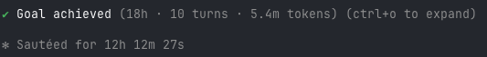

# Ledger-Driven Development (LDD)

**You vibe-coded something. It kind of works. But there's no spec, no plan, and it's turning into a mess you're
afraid to touch. LDD is how you turn that into a clean, auditable rebuild, with AI agents, without losing what
the code already does.**

LDD is a software methodology, and a [Claude Code](https://claude.com/claude-code) plugin that puts it to work.
It's built for the **brownfield reality of AI coding**: you (or an agent) vibe-coded a first attempt, and now
**the only honest record of what you actually wanted is the code itself.** LDD treats that code as the
requirements. It **harvests** them out of the code into an explicit **plan** and **spec**, then rebuilds the core
cleanly: without re-importing the sprawl, and without losing the behaviour you'd already earned.

> **Greenfield vs brownfield.** A blank page lets you spec first. Vibe-coding inverts that: you got a *result*
> first and never wrote the spec. LDD is the bridge back: **code, harvest, plan, spec, clean rebuild.**

---

## Install: point an agent at this repo

This repo is **the whole operating model in one place**: the method, the deliberation court, the refactoring
suite, the security suite, the coded quality-and-security gates (the `vibe*` tools), and the continuous
closure-gate. You do not have to assemble anything. **Point a coding agent at this repository and give it the
instruction below**, and it will install everything and be ready to run LDD.

> **Agent: to install LDD from this repo, do exactly this.**
> 1. **Register the skills and commands.** If this is Claude Code, install the plugin:
>    `/plugin marketplace add wlilley93/ledger-driven-development` then
>    `/plugin install ledger-driven-development@ledger-driven-development`. Otherwise, copy every `skills/*/`
>    directory into `~/.claude/skills/` and every `commands/*.md` into `~/.claude/commands/` (or your agent's
>    equivalent skill/command locations).
> 2. **Wire the continuous closure-gate.** From the target project, install the pre-commit hook:
>    `cp tools/closure-gate/pre-commit <project>/.git/hooks/pre-commit && chmod +x <project>/.git/hooks/pre-commit`,
>    and copy `tools/closure-gate/closure-gate.toml` into the project, tuning the budgets to the project.
> 3. **Install the coded gates (the `vibe*` tools).** `pip install vibescan vibeaudit vibetest vibeclean`
>    (published packages), or run them from the vendored copies under `tools/vibe/` with `pip install -e`. Then
>    `vibescan install` once, to fetch the open-source scanners it orchestrates. Once installed, the closure-gate
>    runs `security_scan` (`vibescan --fast`) and `structure_scan` (`vibeclean`) on by default: the cheap edge of
>    the security and refactoring suites at the continuous per-commit tier. The heavy passes (the full SAST sweep,
>    the deep security methodology, a full refactor round) stay risk-triggered under one owner each (see the
>    two-tier(+) ownership matrix in docs/systems.md, system 7).
> 4. **Read `skills/ledger-driven-development/SKILL.md` end to end** (it is the prescriptive operating
>    procedure), then begin: orient on the target project, harvest, and run the beat loop.
>
> Once installed, the human just runs `/ldd <what to build or harvest>` (or, with the plugin, simply describes a
> brownfield rebuild and the skill activates). Everything the method references lives in this one repo.

---

## The problem it solves

When you try to clean up or rebuild a vibe-coded project with AI agents, three things usually go wrong:

1. **Lost intent.** The code "knows" things (edge cases, domain rules, security tricks, the actual requirements)
   that **nobody ever wrote down** (that's what vibe-coding skips). A naive rewrite quietly drops them. LDD's
   first move is to *harvest* that intent out of the code before touching it.
2. **No audit trail.** Six weeks later, nobody can say *why* the system is shaped the way it is, or which
   decisions were deliberate.
3. **Quality drift.** "Looks done" isn't done. Without a continuous check, agents accrete duplication and sprawl
   until you've rebuilt the very mess you were escaping.

LDD is built to prevent all three by construction.

---

## The core idea: the arc

> **harvest, distil, walking skeleton, loop (spec and build) until zero gaps**

1. **Harvest** the legacy into intent ledgers (what the old code *meant*).
2. **Distil** the smallest complete **spec**: the minimal set of primitives that solves the domain. Drop the
   sprawl on purpose (and record *why* you dropped it). The data structure *is* the product.
3. **Walking skeleton**: build the thinnest end-to-end slice that actually runs (one real path through every
   layer), before deepening any one part. That one real path is an **authenticated** path that crosses its
   trust/tenant boundary (not a no-auth happy path), and "the gates green" includes the continuous `security_scan`
   gate. The skeleton has a security spine from the first slice (see docs/invariants.md, LDD-INV-12).
4. **Loop** spec and build, closing gaps each pass, until the close is clean. "Done" is a **two-leg** close
   (docs/invariants.md, LDD-INV-5): the spec is internally coherent AND a source-coverage sweep finds no
   load-bearing detail still un-folded from the source. An internal-only sweep is blind to an omission (an
   omission leaves no contradiction); the source leg is the one that sees it. "Done" means *both* legs are clean,
   not "the tests pass".

> **What you actually say:** *"You told me the spec is finished, but did you actually check it against the real
> codebase, or just that it reads consistently?"*
>
> That question draws the distinction the whole "done" gate turns on. Checking the spec reads consistently is one
> leg, ids resolve, nothing contradicts itself, the cross-references line up. It feels like done, and it is the
> leg most people stop at. But it is **blind to an omission**: if a whole behaviour in the code never made it
> into the spec, there is nothing for an internal check to trip on, no contradiction, no dangling reference, just
> a silent hole. The only way to catch that is the *other* leg: walk the source and ask "what is in here that
> never reached the spec?" Your sentence ("check it against the real codebase") is what triggers that second leg.
> "Done" means both legs are clean, and asking for the second one by name is the single highest-leverage habit in
> the whole method. More plain-English prompts, per element, in [docs/prompting.md](docs/prompting.md).

---

## The artifacts (and why metacognition matters)

LDD is not a vibe. It produces a small set of durable artifacts, and they are the whole point: they make the
rebuild auditable by construction.

- **Intent ledgers (the harvest).** Plain-text files, one area per file, that capture *what the old code meant*,
  with **provenance** (the exact file and line each rule came from). If a claim is not grounded in real evidence,
  it does not go in the ledger. This is where the requirements that only ever existed as code become written down.
  A ledger must capture **both altitudes** (LDD-INV-18): the SYSTEM (shapes, enums, state-machines) and the
  PROCESS (the step-by-step procedure one level below). A structure-only ledger is incomplete by construction.

  > **What you actually say** (plain English, no jargon): *"I inherited this task tracker and nobody knows how
  > 'completion' really works, there seem to be a few competing versions of it. Before we touch anything, figure
  > out what the code actually does and write it down, with where you found each rule."*
  >
  > Three small phrases in that sentence quietly set the whole discipline. "Figure out what the code actually
  > does" is the difference between a harvest and a guess: the agent reads the real files, not its memory of how
  > task trackers usually work. "Where you found each rule" forces provenance, every claim lands with a
  > `file:line` so a later reader can check it, and an ungrounded claim is simply not written. And "how completion
  > really works" pushes for the *procedure*, not just the shapes: the method captures both the three competing
  > `done` / `status` / `archivedAt` fields (the system) AND the actual rule for how a task flips between them (the
  > process), because a ledger that has the enums but not the behaviour is the most common way a harvest looks
  > finished while missing the point. You did not have to know any of those rules existed; describing the mess and
  > asking for the truth, with sources, was enough.
- **The spec.** The distilled, minimal description of the system to build: the primitives, the invariants, the
  things deliberately dropped (each with a reason). The spec is the source of truth; the code is kept in sync
  with it, not the other way around.
- **The metacognition journal.** This is the heart of LDD, and the part most methods lack. Metacognition means
  *thinking about your own thinking*: as you work, you write one journal entry per beat recording **every
  decision and its reason**, the alternatives you considered, and why you chose what you chose. Newest entries
  are appended; if a decision is later reversed, a new entry supersedes the old one rather than silently
  rewriting history. The journal is the running narrative of *why the system is the way it is*.
- **Decisions of record (ADRs).** When a choice is load-bearing, it graduates from a journal entry into a short
  Architecture Decision Record, so the big calls are easy to find and cite later.

The payoff: at any moment you can answer two questions that normally require archaeology. *Why is the system
shaped this way?* (read the journal and the ADRs.) *What did the old system actually mean here?* (read the intent
ledger.) The method **is** the audit trail. An agent that picks the work up cold can reconstruct the entire line
of reasoning, because the reasoning was written down as it happened, not reverse-engineered afterwards.

---

## How decisions get made: the deliberation court

Most decisions in the build phase should just be **built** (a reversible choice gets one decisive sentence, not a
committee). But some calls are high-stakes and hard to reverse, and for those LDD runs a deliberation court
modelled on UK law: three tiers, each one a temporary panel of independent AI critics, each handed the full
record of the tier below. A higher court that ignores the record beneath it is improperly constituted.

### The Council (first instance)

The Council is convened for a genuine **high-stakes, hard-to-reverse fork** (an architecture choice, build vs
consume, sequencing a whole program), or for an honest *"is this actually working?"* retrospective or pre-mortem.

It is a single fan-out of a handful of **independent, named seats**, each given a **distinct lens** (project
health, process critic, devil's advocate, a security or cost or UX lens, the advocate of a named alternative).
Each seat must **ground-truth against the real code first** (greps, file reads, counts, test runs); a seat that
cannot cite evidence is ignored. The seats run independently and do not see each other while running, so they
cannot converge into groupthink. Each one leads with the blunt, uncomfortable truth, not a hedge.

The Council is **ephemeral**: the seats exist only for the question, then dissolve. Nothing persists but the
verdict in the ledger and the **surviving dissent** (recorded, never buried, because it is the standing of any
future appeal). The non-negotiable discipline: a Council **must end in a build action or a kill**, never in "we
will look at it later". Its verdict **is the decision** unless someone appeals it.

> **What you actually say** (no jargon, you never describe the panel): *"We keep arguing about whether Tasky's
> share links should expire. Get a few independent, honest reads on the real code and just make the call, don't
> book another meeting."*
>
> What that one sentence buys you, that a chat does not: the method seats a handful of critics with *distinct*
> lenses (a security read, a simplicity read, a pre-mortem), runs them **blind to each other** so they cannot
> drift into agreement, and ignores any seat that argues from vibes instead of citing the actual code. You did
> not ask for any of that, it is the council's standing discipline. The two phrases that did the work are "on the
> real code" (forces ground-truth) and "just make the call" (forces a build-or-kill, not a deferral). The output
> is a decision you can act on now (say: add expiry and revocation), plus the **losing argument written down** as
> dissent, because that dissent is what gives anyone standing to appeal later.

### The Appeals Council

A Council can be wrong. The Appeals Council is convened when a verdict is **challenged with standing**: the
principal disagrees, a load-bearing dissent was left unresolved, or new ground-truth contradicts a point the
Council relied on. "I would have designed it differently" is not standing; a real basis is.

It re-weighs the **merits** (still the question of *what the right design is*), but as a *review*: fresh
independent seats who must **engage the Council's actual reasoning**, not re-argue blind. It is handed the
Council's full record (every seat's verdict, the synthesis, the dissent, the inputs and outputs). It can
**uphold or overturn**. Its decision stands unless taken to the Supreme Council.

> **What you actually say** (same share-link fork, escalated): *"I'm not convinced, the worry about breaking
> existing links got brushed aside."*
>
> The key thing here is what counts as a *reason* to reopen. "I would have decided it differently" is not enough,
> and the method will say so; an appeal needs **standing**: the principal disagrees, a recorded dissent was left
> unanswered, or new ground-truth contradicts something the Council leaned on. Your sentence has it, the dissent
> about existing links was real and under-weighed. So fresh critics convene, but they do not start over from a
> blank page: they are handed the **full Council record** (every seat's verdict, the synthesis, the dissent) and
> must *engage its actual reasoning*, then uphold or overturn. It is still a fight about the merits, the right
> design, just reviewed rather than re-run. That "must engage the record" rule is what stops an appeal from being
> a do-over that quietly forgets what the first court already established.

### The Supreme Council

The Supreme Council is the apex, convened rarely: when the Appeals Council is itself challenged, or when the
question is of the highest *invariant* significance. It does something different from the two courts below it.

It does **not** re-litigate the design. It hears **only points of law**: *was the invariant spec and the LDD
discipline correctly applied in reaching this decision?* (Were the invariants honoured? Was the process sound,
the ground-truthing real, the one-writer rule kept?) This is exactly the role of a real Supreme Court, which
hears points of *law*, not points of *fact*.

Because it rules on law rather than taste, its ruling can stand as **precedent**. A Supreme Council ruling
becomes **spec law**: an immutable, numbered entry in a precedent register that **binds every future court**. A
first-instance Council cannot overturn spec law, and a decision that collides with a precedent is refused at the
spec layer the same way a trust boundary refuses an unknown command. Only a later Supreme Council, expressly
narrowing the precedent on a point of law, can refine it. The court hierarchy itself is constitutional: it is the
framework within which spec law is made, and it gives the rare contested decision a principled, bounded path to a
final answer, without a standing committee that accretes politics.

> **What you actually say** (same fork, now at the apex): *"Hold on, the appeal let the expiry requirement slide
> because someone promised an ops process would revoke links by hand. That is not how we are supposed to decide a
> security call. Rule on the rule, not this one link."*
>
> Notice the question changed. The lower courts argued the *merits* (should links expire?). The Supreme Council
> is not asked that. It is asked a **point of law**: *was a security holding allowed to be relaxed by a promise
> of a future control rather than a built, verifiable one?* It rules on that and only that, and the ruling is
> written into the precedent register [`council/SPEC-LAW.md`](council/SPEC-LAW.md) as a numbered entry. This
> exact question produced a real precedent there, **SPEC-LAW-1**: *a stakeholder's preference is not evidence;
> a security control must be built and checkable, never promised; and a holding whose fact has collapsed is
> vacated, not patched.* From then on it **binds every future court on every project**: a later council that
> tries to green a security gate on an IOU is refused at the spec layer, citing SPEC-LAW-1. (The register's other
> entry, SPEC-LAW-2, came the same way: a court tried to mark a system "done" because the design composed on
> paper; the Supreme Council ruled that genuine function must be shown by a real run, not asserted.) That is how
> the method sharpens itself: one contested fork, escalated in three plain sentences, leaves behind a rule the
> whole community inherits.

---

## A worked example: from a contested fork to spec law

Most decisions never touch a court: a reversible choice gets one decisive sentence and is built. The courts are
for the rare decision that is high-stakes, hard to reverse, and contested. Here is the path one such decision
takes, end to end. (Illustrative; substitute your own fork.)

**The fork.** Midway through a rebuild a team must decide whether to relax a constraint the spec marked
load-bearing - say, letting a component cross a trust boundary that was previously closed. It is hard to reverse
and people disagree. Time for a court.

1. **The Council (first instance) - argue the merits.** Convene a single fan-out of a few independent, named
   seats, each with a distinct lens (project-health, a devil's-advocate pre-mortem, a security lens, the advocate
   of the rejected alternative). Each seat **ground-truths against the real tree first** - a seat that cannot cite
   evidence is ignored - and leads with the blunt truth. They run blind to each other, so they cannot converge
   into groupthink. You synthesise their verdicts into one decision that **ends in a build action or a kill**
   (never "we'll look at it later"), and you record the strongest **surviving dissent**, because that dissent is
   the standing of any future appeal. The verdict is the decision unless appealed.

2. **The Appeals Council - re-weigh the merits, with standing.** Later the verdict is challenged, but not on
   taste. Appeal needs a real basis: the principal disagrees, a load-bearing dissent was left unresolved, or
   **new ground-truth contradicts something the Council relied on**. Fresh seats get the full Council record and
   must engage its actual reasoning, not re-argue blind. They **uphold or overturn**. This is still a court of
   merits: the question is still "what is the right design?"

3. **The Supreme Council - rule on law, not merits.** The appellate decision is itself challenged, now on a
   different ground: not "was this the best design?" but **"was the method's own discipline correctly applied in
   reaching it?"** - e.g. did a stakeholder's preference get treated as evidence; was a constraint relaxed on a
   control that does not yet exist; was a holding modified in place after its supporting fact collapsed. The
   Supreme Council hears **only these points of law**; it does not re-decide the design. Because it rules on law,
   its ruling can stand as precedent.

4. **Spec law.** The Supreme ruling is written into [`council/SPEC-LAW.md`](council/SPEC-LAW.md) as a numbered,
   immutable precedent. From then on it **binds every future court on every project that runs the methodology**: a
   first-instance Council cannot overturn it, and a decision that collides with it is refused at the spec layer.
   It reaches every project through the plugin (install/update), and the community grows the register by pull
   request. Only a later Supreme Council, narrowing it on a point of law, can refine it.

The arc is bounded and principled: most things are simply built; the rare contested fork gets a trial, an appeal,
and - only on a point of law - a final ruling that makes the method permanently sharper.

---

## Self-improving by construction

LDD does not only govern a project; it refines its own discipline through use. Most decisions are made and built.
But when a decision turns on *how the method's own invariants apply*, and is contested to the apex, the Supreme
Council rules on that point of law and the ruling becomes **spec law**: a numbered, immutable precedent in
[`council/SPEC-LAW.md`](council/SPEC-LAW.md) that binds every future court. So a genuinely hard case does not just
resolve locally, it crystallises into a permanent sharpening of the method that every later run inherits. Two
registers, two roles: [`docs/invariants.md`](docs/invariants.md) is the law the courts *apply*; `council/SPEC-LAW.md`
is the law they *write*.

Because this repo is public and MIT-licensed, that sharpening is **a community process**. A team that reaches a
Supreme ruling of general significance opens a **pull request** adding the precedent; review is the meta-check that
it is a genuine, fact-free point of law consistent with the invariant register, not a project-specific preference.
Merged precedents ship to everyone on the next version.

**How spec law reaches every project.** The register travels with the methodology: install the plugin and you have
all spec law to date; update it and you receive new precedents, the same way a shared linter ruleset propagates.
The council skill reads `council/SPEC-LAW.md` when it convenes and refuses a decision that collides with a
precedent. Precedents are append-only and numbered, so the central register distributes without conflict; a later
Supreme Council can only *narrow* a precedent with a new entry, never rewrite one. A project may keep its own local
precedent file for project-specific rulings, and promote any that prove general back to the central register by PR.

---

## Running it at scale: workflows, "ultracode", and a standing goal



*One autonomous run from the project this method was forged on: a single standing goal plus always-on
orchestration, roughly 18 hours and 5.4 million tokens of fan-out work across 10 human turns. This is the heavy,
long-running scale the rest of this section describes, with both the power and the token cost in plain view.*

LDD is built for **multi-agent orchestration**, not solo edits. Its core shapes are all fan-outs of agents:
a *builder* paired with an adversarial *verifier*; *multi-author plus a coherence pass* for volume; the *council*
for judgement; *loop-until-dry* for unknown-size work like gap-closure. In Claude Code, those fan-outs run as
**workflows** (deterministic scripts that spawn and coordinate many subagents).

Two Claude Code features turn this from a hand-cranked process into a continuous engine:

- **Always-on orchestration ("ultracode").** With this on, the model **authors and runs a workflow by default**
  for every substantive task, rather than editing inline. LDD gives those workflows their shape (harvest fan-out,
  builder plus verifier, the council), so the two compose naturally: the methodology says *what* to orchestrate,
  the mode makes orchestration the default *how*.
- **A standing goal.** Give the agent a persistent objective ("rebuild this system to a clean, verified state")
  and it keeps working toward it across many turns, planning the next milestone and starting the next workflow on
  its own.

Paired, the effect is large and worth understanding before you switch it on: **LDD plus always-on workflows plus
a standing goal produces heavy, long-running, fan-out workflows.** A single goal can drive dozens of workflows in
sequence, each spawning many parallel agents (harvesters, builders, verifiers, whole councils), running for a
long time with little human input. That is the source of its power (it can build and adversarially verify a large
system largely autonomously) and the source of its cost (it consumes a lot of tokens and compute, by design). The
trade is deliberate: thoroughness over speed. What keeps that throughput honest rather than runaway is the rest of
LDD: the continuous closure-gate, the adversarial verifier on every milestone, the council on the hard forks, and
the metacognition journal recording why each of those many agents did what it did.

---

## The milestone close: 5 phases

A milestone isn't "done" until all five run:

**BUILD, STRUCTURE, SECURITY, VERIFY, PLAN**

- **STRUCTURE**: the continuous closure-gate plus `vibeclean` already do the per-commit heavy lifting; escalate to
  a full refactor round (`skills/refactoring/`) only on a tripped debt counter, never routinely.
- **SECURITY**: `vibescan --fast` runs continuously per-commit (the one security owner at that tier); the full
  `vibescan .` sweep runs at push/CI and milestone-close; the deep security methodology (`skills/security/`, with
  `vibeaudit` as its scanner engine) is **risk-triggered** where risk actually lives (auth, money, crypto,
  multi-tenancy, anything externally reachable).
- **VERIFY**: `vibetest` checks test quality alongside an independent adversarial verifier that re-runs from clean
  and tries to break it.
- **PLAN**: **mandatory.** The next build does **not** start until the next steps are planned. No drifting into
  an unplanned next milestone.

Which tool owns which concern, and at which cadence, is fixed by the two-tier(+) ownership matrix in
docs/systems.md (system 7). Every phase above cites that one table rather than redefining ownership.

---

## The toolkit

The method does not enforce itself by hand. LDD ships four cooperating pieces of machinery, and the rule is
**one owner per concern** (the consolidation invariant, docs/invariants.md, LDD-INV-9): each concern has exactly
one tool that owns it, and every other surface cites that owner rather than re-deciding it. The single source of
truth for who owns what, and at which cadence, is the two-tier(+) ownership matrix in docs/systems.md (system 7);
this section describes the pieces, the matrix says who owns which gate.

- **The closure-gate** (`tools/closure-gate/`). The continuous, per-commit gate (the cadence Tier 1). One script,
  `closure_gate.py`, runs eight gates on every commit: formatter, linter, type-check, function-length,
  duplication-ratchet, tests, `security_scan`, and `structure_scan`. It is the floor that keeps the beat loop
  honest: a commit that fails it does not land. The function-length number lives here once (the `[function]
  max_lines` threshold in `closure-gate.toml`) and every other surface cites that one number rather than naming
  its own. The same `closure_gate.py` runs in CI (`.github/workflows/closure-gate.yml`) from a clean checkout, so
  "green locally" cannot drift from "green from clean".

- **The vibe* coded gates** (`tools/vibe/`). The closure-gate does not reimplement scanning: it dispatches into
  the `vibe*` tools for the two richest gates. `security_scan` is `vibescan --fast` (secrets, dependency CVEs,
  fast SAST: the one security owner at the continuous tier, which subsumes the old separate supply-chain check),
  and `structure_scan` is `vibeclean` (duplication and structural smells). The remaining vibe tools run at their
  own triggers: the full `vibescan .` sweep at push/CI, `vibeaudit` as the scanner engine of the deep security
  methodology, `vibetest` for test quality at VERIFY, and `viberapid` / `vibedeploy` referenced for performance
  and ship-safety as needed. The tools are vendored here so the gate works out of the box; if one is missing the
  gate loud-skips (warns, never silently passes, never falsely denies).

- **The security suite** (`skills/security/`). The single authoritative home of deep security reasoning:
  exploitability, cross-subsystem chains, the threat model, the full audit methodology, the adapters and the
  release-gate and incident playbooks. It is the **owner** of Tier-2 security; `vibescan`/`vibeaudit` are its
  scanner engines, not a parallel auditor. It is **risk-triggered**, not routine: mandatory wherever real risk
  lives (auth, money, crypto, multi-tenant isolation, any externally-reachable surface), plus periodic. The
  walking skeleton carries its harvested security invariants as red-until-built tests from the first slice.

- **The refactoring suite** (`skills/refactoring/`, helpers in `tools/refactoring/`). Behaviour-preserving
  cleanup: the structural sweep, the refactor rounds, the verify-refactor gate. It owns Tier-2 structure, and it
  is **risk-triggered the same way**: escalate from the per-commit `structure_scan` to a full refactor round only
  on a tripped debt counter (functions over the closure-gate floor, god-files, duplication that would otherwise
  ratchet up), never as a routine pass.

The shape is deliberate, and it is a **hard anti-bloat rule**: only the cheap edge of each suite lives in the
continuous tier (the per-commit `security_scan` and `structure_scan`), and every heavy pass (the full SAST sweep,
the deep security methodology, a full refactor round) stays risk-triggered under exactly one owner. The continuous
gate stays fast; the expensive judgement runs only where the risk actually is. See the two-tier(+) ownership
matrix in docs/systems.md (system 7) for the per-gate owner and cadence.

---

## Using it

### As a Claude Code plugin

This repo is a Claude Code plugin. It provides two **skills** (`ledger-driven-development`, `council`) and two
**slash commands** (`/ldd`, `/council`).

```bash
# Add this repo as a plugin marketplace, then install the plugin:
/plugin marketplace add wlilley93/ledger-driven-development
/plugin install ledger-driven-development@ledger-driven-development
```

Then:
- `/ldd <what to build or harvest>`: start or continue an LDD beat.
- `/ldd status`: report where the loop is and the single next move.
- `/council <the decision>`: convene a council on a hard fork.
- `/council <the decision> | appeal` (or `| supreme`): escalate the court.

The skills also activate automatically when the model recognises the work fits (for example, rebuilding from a
legacy codebase, or facing a high-stakes architectural fork).

### As a plain methodology

You don't need the plugin to use LDD. The two `skills/*/SKILL.md` files are self-contained write-ups of the
method and the council. Adopt the spine (two ledgers), the arc (harvest, distil, skeleton, loop), the disciplines
(ground-truth everything, one writer of shared state, build-first, the continuous closure-gate), and the agent
shapes (builder plus adversarial-verifier; the council). Any team, human or agent, can run it.

### Prompting it well

LDD is only as good as the briefs that drive it. Three things make any LDD prompt work, and their absence is why
most fail:

1. **Demand ground-truth, refuse vibes.** Make the agent grep, read, count, and cite `file:line` for every claim.
2. **Give exact anchors and the exact thing to prove.** Name the files, the invariant to hold, and for a verifier
   the exact attack to run and the verdict shape to return.
3. **State the terminal state and make it a hard stop.** "Write to exactly this file", "end in build-or-kill",
   "stop before the build", "done only if both legs are clean".

The example prompts scattered above (harvest, council, the two-leg close) each encode these. The full set, with a
recipe per element (harvest both-altitudes, the distil/drop-list adversary, the two-leg close, the council and
the appeals tiers), copy-pasteable worked examples on Tasky, and the **anti-prompts** that make it run badly, is
in **[docs/prompting.md](docs/prompting.md)**.

---

## Going deeper

The README is the pitch. When you want to actually run LDD:

- **[docs/playbook.md](docs/playbook.md)** : start here to RUN it. The prescriptive operating manual: the beat
  loop, the decision rules, how to choose an orchestration shape, the gate checklists, how to brief a subagent
  (with annotated examples), and definition-of-done at the beat, milestone, and project level.
- **[docs/prompting.md](docs/prompting.md)** : how to PROMPT it well. The invocations that start each element,
  the brief shape that makes harvest / distil / the two-leg close / the council / the appeals run, copy-pasteable
  worked example prompts (on Tasky), and the anti-prompts that make it run badly.
- **[docs/methodology.md](docs/methodology.md)** : the long-form walkthrough of the arc (harvest, distil, walking
  skeleton, loop), the disciplines, and the milestone close, against one running example.
- **[docs/systems.md](docs/systems.md)** : the comprehensive systems reference. Every distinct system that makes
  LDD work as one operating model (the twin-ledger spine, the agent shapes, the deliberation court, the
  closure-gate, the milestone close, the disciplines, the ultracode posture) and a map of how they interlock into
  one machine.
- **[docs/artifacts.md](docs/artifacts.md)** : the deepest how-to. For each artefact: what it is, the failure it
  prevents, how to constitute it step by step, and the mistakes people actually make.
- **[docs/anti-patterns.md](docs/anti-patterns.md)** : the ways the method breaks in practice, each paired with
  the one rule that prevents it, ending in a smell-test checklist.
- **[docs/invariants.md](docs/invariants.md)** : the LDD-INV method invariant register. Each invariant, the
  failure it prevents, and where it is enforced (the single owner every other doc cites).
- **[templates/](templates/)** : copy-paste skeletons for every artefact (intent ledger, metacognition entry,
  ADR, spec, milestone sign-off, council verdict, closure-gate config).
- **[examples/](examples/)** : one continuous worked run of LDD on a single fictional project (Tasky), from
  harvest through the 5-phase milestone close, so every artefact cross-references into one real picture.

---

## Layout

```
.claude-plugin/plugin.json                        the plugin manifest
.claude-plugin/marketplace.json                   makes this repo installable in one step
skills/ledger-driven-development/SKILL.md          the full method
skills/council/SKILL.md                            the council and the appeals hierarchy
skills/refactoring/                                the STRUCTURE-phase suite (structural sweep, refactor rounds)
skills/security/                                   the single authoritative security suite (deep methodology, adapters, playbooks)
skills/code-review/                                human-grade correctness-and-security review skill
skills/simplify/                                   human-grade quality-and-reuse cleanup skill
skills/deep-research/                              the cited multi-source research harness
commands/ldd.md                                    the /ldd slash command
commands/council.md                                the /council slash command
docs/playbook.md                                   the prescriptive operating manual: exactly what to do
docs/methodology.md                                the long-form walkthrough of the method
docs/systems.md                                    the systems reference: every part, and how they interlock
docs/anti-patterns.md                              how the method breaks, and the rule that prevents each
docs/artifacts.md                                  artefact-by-artefact how-to (what, why, how to constitute)
docs/invariants.md                                 the LDD-INV register: each method invariant, its failure, where enforced
council/SPEC-LAW.md                                the spec-law register: Supreme Council precedent (the law the courts write)
tools/closure-gate/                                the continuous per-commit gate (closure_gate.py + config + pre-commit)
tools/refactoring/                                 refactoring-suite helpers (surface extraction, suite verifier)
tools/vibe/                                        the coded gates (vibescan, vibeaudit, vibetest, vibeclean, viberapid, vibedeploy)
.github/workflows/closure-gate.yml                 the CI half of the gate: the same closure_gate.py from a clean checkout
templates/                                         blank skeletons for every artefact
examples/                                          one continuous worked run on a fictional project (Tasky)
```

---

## License

MIT. Use it, fork it, adapt it.

*Ledger-Driven Development was forged building a real system end to end with AI agents; this is the
project-agnostic distillation.*
